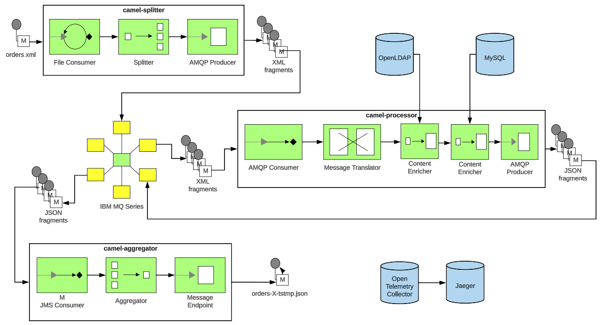

:scrollbar:
:data-uri:
:toc2:
:linkattrs:

= camel-orders-demo

:numbered:

== Start

Clone this project to your local environment and change directory into the project.

=== Local

==== Pre-Reqs

This project includes a _docker-compose_ file that specifies deployment of a relational database (mysql) and messaging broker(activemq-artemis) as containers in your local environment.

- docker-compose
+
Depending on your environment, either podman or docker can be used to support _docker-compose_.
+
NOTE:  If underlying linux container system in use in your local environment is podman, then follow this link:https://fedoramagazine.org/use-docker-compose-with-podman-to-orchestrate-containers-on-fedora/[set-up guide].

- link:http://maven.apache.org[Apache Maven 3.x]
- JDK 11 (or more recent)

==== Run in _quarkus:dev_ mode:

. Review the contents of the link:etc/docker-compose[docker-compose] file included in this project.
. Start all linux containers:
+
-----
$ docker-compose -f etc/docker-compose.yaml up -d
-----
+
NOTE:  In this branch, an IBM MQSeries container (enabled with AMQP) is started.

. Buid all sub-projects:
+
-----
$ mvn clean install -DskipTests
-----

. The project consists of three quarkus apps that can be run in _dev_ mode.
+
Execute each of the following in its own separate terminal window/tab.
+
-----
$ ( cd camel-splitter; mvn clean quarkus:dev )
$ ( cd camel-processor; mvn clean quarkus:dev )
$ ( cd camel-aggregator; mvn clean quarkus:dev )
-----

=== OpenShift

==== Pre-Reqs

- OpenShift Container Platform 4.12 (or more recent)
. *Resource requirements*
+
Resource requirements as needed by the app (doesn’t include resource requirements of Openshift to support itself) is as follows:

.. RAM: 6 GB

.. CPU: 6

.. Storage: 3 PVCs of type RWO (no RWX requirement) and each of size 5 GiB

. *cluster-admin credentials* to this OpenShift cluster are needed

. *wildcard certificate for routes*
+
Out-of-the-box install of OCP typically includes self-signed certs to secure the cluster's routes.  It is highly recommended that a wildcard cert issued by a well-known certificate authority (ie:  ZeroSSL) be applied to the cluster.

- *oc utility* (of version correspsonding to OCP cluster) installed locally
+
All versions of this utility are available at either of the following:

.. https://access.redhat.com/downloads/content/290 
+
RHN subscription required

.. https://mirror.openshift.com/pub/openshift-v4/clients/ocp/?C=M;O=D
+
Accessible without a RHN subscription

==== Deployment

. Deployment Red Hat AMQ Broker operator and create `user1-camel-orders` namespace:
+
-----
$ oc apply -k config_mgmt/gitops/overlays/mqseries/infra/
-----

. Deploy all apps into `user1-camel-orders` namespace:
+
-----
$ oc apply \
    -k config_mgmt/gitops/overlays/mqseries/apps \
    -n user1-camel-orders
-----

. Wait until _camel-aggregator_ app is running in `user1-camel-orders` namespace:
+
-----
$ oc rollout status deployment camel-aggregator \
    -n user1-camel-orders
-----

== Test

. Set URLs of the various apps of this projectas environment variables:

.. If application is deployed locally:
+
-----
$ export CAMEL_SPLITTER_URL=http://localhost:8080 \
  && export CAMEL_AGGREGATOR_URL=http://localhost:6060 \
  && export JAEGER_URL=http://localhost:16686 \
  && export ARTEMIS_ADMIN_URL=http://localhost:8161
-----

.. If application is deployed in OpenShift:
+
-----
$ export CAMEL_SPLITTER_URL=https://$(oc get route camel-splitter -n user1-camel-orders --template='{{ .spec.host }}') \
  && export CAMEL_AGGREGATOR_URL=https://$(oc get route camel-aggregator -n user1-camel-orders --template='{{ .spec.host }}') \
  && export JAEGER_URL=https://$(oc get route jaeger -n user1-camel-orders --template='{{ .spec.host }}') 
-----

. Invoke the `camel-splitter` RESTful endpoint by POSTing a `multipart/form-data` request:
+
-----
$ curl -X POST \
       -v \
       -F '@file=@./camel-splitter/src/test/data/orders-01.xml' \
       "$CAMEL_SPLITTER_URL/camel/files/"
-----
+
Results should be as follows:

.. Client invoking the POST request:
+
-----
HTTP/1.1 200 OK

  ...

upload-BE7625902D3F764-0000000000000002.xmlj
-----

.. _camel-aggregator_ app:
+
-----
05:32:41 INFO  [route5] (Camel (camel-1) thread #2 - JmsConsumer[processed]) Picked up processed order: [{"customer":"1","item":"1","description":"Ball Bearing","quantity":4}]
05:32:41 INFO  [route5] (Camel (camel-1) thread #2 - JmsConsumer[processed]) Picked up processed order: [{"customer":"1","item":"2","description":"Rotator Splint","quantity":2}]
05:32:47 INFO  [route5] (Camel (camel-1) thread #3 - Aggregator) Completing aggregate order: [1]
-----

. To list the processed files:
+
-----
$ curl -X GET \
      -v \
      -H 'Accept: text/plain' \
       "$CAMEL_AGGREGATOR_URL/camel/files/"
-----

. To see contents of a file:
.. Set file name as an env variable:
+
-----
$ export ORDER_FILE_NAME=<change me>
-----

.. Retrieve contents of file:
+
-----
$ curl -X GET \
    -H 'Accept: application/json' \
    "$CAMEL_AGGREGATOR_URL/camel/files/$ORDER_FILE_NAME"
-----

== Tracing Options

=== OpenTelemetry

* Camel/Quarkus link:https://camel.apache.org/camel-quarkus/3.0.x/reference/extensions/opentelemetry.html[OpenTelemetry component]

* Appears that Splunk link:https://www.splunk.com/en_us/solutions/opentelemetry.html[suppots OpenTelemetry] as well.

. In a browser tab, navigate to the value of:  $JAEGER_URL
+

. In the left panel, select `camel-splitter` from the _Service_ drop-downlist and then click: `Find Traces`.
. Select the most recent trace, and view the _digital thread_ of service invocations.
+

=== Custom Header
* Create your own _user_ header (ie:  X-CORRELATION-ID) in exchange

* Custom exchange header will get propogated from one route to the next

=== breadcrumb and MDC (deprecated)

* A _breadcrumbId_ is used mainly internally by Apache Camel to track a message through different transports.

* Leverages Camel's link:https://people.apache.org/~dkulp/camel/mdc-logging.html[Mapped Diagnostic Contexts (MDCs) Logging] component.

* However, the intent is to link:https://camel.apache.org/blog/2023/01/camel4roadmap/[deprecate MDC Logging in Camel 4]

== LDAP
. link:https://issues.redhat.com/browse/CEQ-6167[Support extension: camel-quarkus-ldap]

== IBM MQSeries

=== Proprietary JMS 

. link:https://github.com/ibm-messaging/mq-dev-patterns/issues/81#issuecomment-1157443469[Discussion about using IBM JMS classes]

. link:https://issues.redhat.com/browse/CEQ-4878[JMS components connection pooling (generic client, full support)]
+
Discusses connection pooling to IBM MQ Series

. podman run:
+
-----
$ podman run --rm --name=mqseries -p 5672:5672 -p 1414:1414 -p 9443:9443 -e MQ_QMGR_NAME=QM1 -e MQ_APP_PASSWORD=passw0rd -e MQ_ADMIN_PASSWORD=passw0rd -e LICENSE=accept localhost/ibm-mqadvanced-server-dev:9.2.5.0-amd64
-----

=== Security

-----
-----

. Display QMGR connection auth:
+
-----
$ runmqsc
$ DISPLAY QMGR CONNAUTH
-----
+
The CONNAUTH value is a name of an AUTHINFO MQ object. MQ version 8 supports two methods of authentication: using the operating system (AUTHTYPE(IDPWOS)) or using LDAP (not available on z/OS) (AUTHTYPE(IDPWLDAP)).

. Display authentication information details:
+
-----
$ display authinfo(SYSTEM.DEFAULT.AUTHINFO.IDPWOS)
-----
+
-----
   AUTHINFO(SYSTEM.DEFAULT.AUTHINFO.IDPWOS)
   AUTHTYPE(IDPWOS)                        ADOPTCTX(YES)
   DESCR( )                                CHCKCLNT(REQDADM)
   CHCKLOCL(OPTIONAL)                      FAILDLAY(1)
   AUTHENMD(OS)                            ALTDATE(2023-07-05)
   ALTTIME(14.02.37)
-----

.. REQDADM
+
Privileged users are REQUIRED to provide a password but non-privileged users don’t have to.

=== Issues

. cat /var/mqm/qmgrs/QM1/errors/amqp_0.log
+
-----
AMQXR0033E: A connection from 10.129.0.23 for client identifier 'ID:a073664b-a901-46e5-a989-8d476fa4a023:1' was rejected for channel SYSTEM.DEF.AMQP because of CONNAUTH or CHLAUTH rule configuration. MQCC 2, MQRC 2330 MQRC_CODED_CHAR_SET_ID_ERROR
-----

. Workaround:
+
-----
$ oc rsh mqseries-666fb45d54-q5d4q
$ runmqsc

ALTER QMGR CHLAUTH(DISABLED)
-----

== LDAP
. link:https://issues.redhat.com/browse/CEQ-6167[Support extension: camel-quarkus-ldap]

== Build

-----
$ mvn clean package \
    -DskipTests \
    -Dquarkus.container-image.build=true \
    -Dquarkus.container-image.push=true
-----

